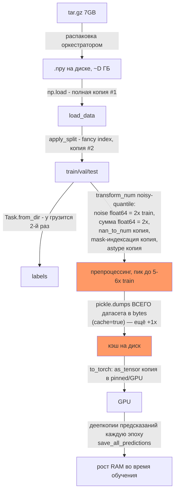

# Отчёт: заполнение RAM в `tabpack.py exp/tabpack/0/peru/main --force --ddp` и как избежать OOM

## 0. Общая картина

Датасет peru — это `x_num.npy` (float32, пишется через [`np.lib.format.open_memmap()`](../code/tabpack-ag/convert/convert_polars.py:394) в конвертере) + `y.npy` + `splits/`. tar.gz на 7 ГБ — это сильно сжатый float32; после распаковки на диске это уже сотни ГБ. Дальше пайплайн загрузки **никогда не использует mmap** и делает **6–8 полных копий данных в RAM**, а с `--ddp` всё это умножается на число GPU-процессов. Отсюда и 800 ГБ.



**Важно:** всё, что выше, выполняется **в каждом из N DDP-процессов независимо** — шардирование происходит уже *после* полной загрузки и препроцессинга.

---

## 1. Фаза загрузки данных (главный источник OOM)

### 1.1 `np.load` без mmap — копия №1
[`lib.data.load_data()`](../code/tabpack-ag/lib/data.py:158) читает все `.npy` целиком в RAM:
```python
data = {x.stem: np.load(x) for x in dataset_dir.iterdir() if _is_npy_path(x)}
```
Для peru это сразу полный размер датасета (обозначим **D** ГБ).

### 1.2 `apply_split` — копия №2
[`lib.data.apply_split()`](../code/tabpack-ag/lib/data.py:135) индексирует массив int-массивом: `data[v]` — fancy indexing в NumPy **всегда копия**, даже при `copy=False`. Пока `load_data` не вернулась, в памяти живут и полный массив, и все его части → пик **≈ 2×D**.

### 1.3 `Task.from_dir` — `y.npy` грузится второй раз
[`Task.from_dir()`](../code/tabpack-ag/lib/data.py:375) снова делает `np.load(dataset_dir / 'y.npy')` + `apply_split(..., copy=True)`, хотя `y` уже загружен в `load_data`. Для 1D `y` это мелочь по сравнению с `x_num`, но всё равно лишняя работа.

### 1.4 `transform_num(num_policy="noisy-quantile")` — худшее место, пик до ~5–6× train
В конфиге peru: `num_policy = "noisy-quantile"`. В [`lib.data.transform_num()`](../code/tabpack-ag/lib/data.py:203):

| Строка | Операция | Стоимость |
|---|---|---|
| [`data.py:219`](../code/tabpack-ag/lib/data.py:219) | `np.random.RandomState(seed).normal(0.0, 1e-5, X_num_train.shape)` | **float64** массив размера train = **2× train** (astype до float32 делается после того, как float64 уже материализован) |
| [`data.py:219`](../code/tabpack-ag/lib/data.py:219) | `X_num_train + noise` | ещё одна полная копия |
| [`data.py:214`](../code/tabpack-ag/lib/data.py:214) | `QuantileTransformer(subsample=1_000_000_000)` | fit по **всем** строкам train + внутренние сортировки/копии sklearn |
| [`data.py:226`](../code/tabpack-ag/lib/data.py:226) | `normalizer.transform(v)` для каждой части | новые массивы (QuantileTransformer часто отдаёт float64 → 2×) |
| [`data.py:233`](../code/tabpack-ag/lib/data.py:233) | `np.nan_to_num(v)` | **полная копия каждой части** (даже если NaN нет) |
| [`data.py:236-237`](../code/tabpack-ag/lib/data.py:236) | `np.unique` по каждому столбцу + `v[:, mask]` | unique сортирует столбец (копии), маскированная индексация — **ещё полная копия** |
| [`data.py:239`](../code/tabpack-ag/lib/data.py:239) | `v.astype(_X_NUM_DTYPE)` | по умолчанию `copy=True` → **копия даже если dtype уже float32** |

Плюс `extract_bin_from_num = true`: [`_extract_bin_from_num()`](../code/tabpack-ag/lib/data.py:246) первым делом делает `np.concatenate(list(X_num.values()))` — **ещё одна полная копия всего датасета**, потом `np.isnan` (bool-маска = ¼ D), `np.unique` по каждому столбцу.

### 1.5 `cache = true` — pickle всего датасета в память
В [`build_dataset()`](../code/tabpack-ag/lib/data.py:611):
```python
tmp_cache_file.write(pickle.dumps((args, dataset)))
```
`pickle.dumps` собирает **весь датасет в один bytes-объект в RAM** → в момент записи кэша пик = *датасет + его полная сериализованная копия* (**+1×D**). При чтении кэша ([`data.py:563`](../code/tabpack-ag/lib/data.py:563)) — `cache_path.read_bytes()` + `pickle.loads` → тоже кратковременно **2×D**.

Дополнительно: `os.rename(tmp_cache_file.name, cache_path)` внутри `with NamedTemporaryFile` — файл переименовывается, а менеджер контекста потом попытается удалить уже несуществующий tmp; в DDP это ещё и **гонка между рангами** (см. п.3).

---

## 2. Фаза переноса на GPU

### 2.1 Шардирование сделано правильно по идее, но поздно по факту
В [`main()`](../code/tabpack-ag/bin/tabpack/tabpack.py:1338) train-часть режется срезом `slice(local_rank, N, world_size)` **до** `to_torch(device)` — это хорошо для VRAM. Но **до этого места каждый ранг уже прогнал полный пайплайн из п.1**. То есть RAM-стоимость = `N_gpu × (полный пайплайн)`.

Нюанс: `dataset.data[key]['train'][train_slice]` — это strided **view**, он держит ссылку на весь исходный массив. Исходный не освободится, пока жив view; реально память отпускается только после `to_torch` (там `torch.as_tensor` на некontiguous view сделает копию). Стоит сделать `.copy()` среза и явно удалить исходные массивы.

### 2.2 Что попадает в VRAM
[`Dataset.to_torch()`](../code/tabpack-ag/lib/data.py:456) переносит **все** части (train-шард + полные val/test на каждом GPU) + [`_make_Y_train()`](../code/tabpack-ag/bin/tabpack/tabpack.py:945) — ещё одна копия `y_train` в float/long.

### 2.3 `generate_training_batches` — скрытый пожиратель VRAM
[`generate_training_batches()`](../code/tabpack-ag/bin/tabpack/tabpack.py:850):
```python
random_values = torch.rand((pack_size, train_size), ...)   # float32
batches = random_values.argsort(dim=BATCH_DIM)...          # int64
```
С `n_models = 64` (config peru) это `64 × train_size × (4 + 8)` байт **на GPU каждую эпоху**. При train-шарде в 25M строк это ~19 ГБ временных тензоров. При OOM на GPU — первый кандидат.

---

## 3. DDP-специфичные проблемы

1. **N-кратная загрузка**: 4 процесса × (пайплайн из п.1) — основная причина «800 ГБ». Даже без копий пайплайна 4 × 2–3 × D легко превышает лимит кубика.
2. **Гонка за кэш**: все ранги одновременно пишут один и тот же `cache/build_dataset__peru__<hash>.pickle` через `os.rename` — недетерминированно и умножает пиковую память (все ранги одновременно держат pickle-байты).
3. **`seed` одинаковый на всех рангах**: [`delu.random.seed(config['seed'])`](../code/tabpack-ag/bin/tabpack/tabpack.py:1308) и `batch_generator` с тем же seed → все ранги генерируют одинаковые перестановки батчей своих шардов (это ок для корректности, но `noisy-quantile`-шум тоже будет одинаковым — просто имейте в виду).
4. Отчёты/предсказания пишет только rank 0 — тут всё корректно.

---

## 4. Рост RAM/VRAM во время обучения (медленный «лик»)

Конфиг peru: `n_models = 64`, `patience = 16`, `n_epochs = -1`, `save_all_predictions = true`, `track_online_ensemble_history = true`.

1. **`save_all_predictions = true` — неограниченный рост.** Каждую эпоху [`pack_epochs_numlog.append(deepcopy(...))`](../code/tabpack-ag/bin/tabpack/tabpack.py:1666) кладёт в список **полную копию предсказаний всех живых моделей на val+test**. Для val+test размера V и 64 моделей это `64 × V × 4 байта` **за эпоху**, эпох могут быть сотни. Для большого датасета это десятки-сотни ГБ чистого роста CPU-RAM. **Это второй по важности источник OOM после загрузки.**
2. **Дублирование предсказаний CPU+GPU.** [`_evaluate()`](../code/tabpack-ag/bin/tabpack/tabpack.py:877) возвращает и `predictions` (numpy) и `predictions_torch` (VRAM); [`StatePack.update()`](../code/tabpack-ag/bin/tabpack/tabpack.py:383) хранит `deepcopy` обоих + `best_model_state_dicts` (веса всех 64 моделей на GPU). Пул онлайн-ансамбля в [`OnlineEnsemble._prepare_pool()`](../code/tabpack-ag/bin/tabpack/tabpack.py:677) каждую эпоху делает `np.concat`/`torch.cat` finished+running предсказаний — большие временные буферы каждую эпоху.
3. **`FinalStatePack.extend()`** ([`tabpack.py:457`](../code/tabpack-ag/bin/tabpack/tabpack.py:457)) накапливает train+val+test предсказания всех 64 финишировавших моделей и в numpy, и в torch — до конца работы.
4. **`steps_numlog`** ([`tabpack.py:1632`](../code/tabpack-ag/bin/tabpack/tabpack.py:1632)) хранит `loss.detach()` как **CUDA-тензор** на каждый шаг — тысячи мелких живых CUDA-аллокаций (фрагментация аллокатора) до самого конца. В конце `to_numpy`/`numpy_stack` разом конвертирует всё.
5. **Метрики**: [`calculate_metrics_pack()`](../code/tabpack-ag/bin/tabpack/metrics.py:25) делает `np.repeat(y_true, 64)` — временный массив `64 × V` каждую эпоху + транспонирования для sklearn.

---

## 5. Что чинить (по приоритету)

### P0 — убрать N-кратную загрузку в DDP
Готовить датасет **один раз** и раздавать через mmap:
- rank 0 строит датасет и пишет кэш; остальные ранги ждут `dist.barrier()` и читают кэш;
- кэш хранить не pickle-ом, а как отдельные `.npy` (`np.save` по ключам) и читать через `np.load(..., mmap_mode='r')` — тогда все процессы **делят одни и те же физические страницы** через page cache, и RAM-стоимость датасета становится ~1×D на машину вместо N×(2–3)D;
- срез шарда делать `np.ascontiguousarray(arr[rank::world])` и сразу `del` исходного mmap-массива.

### P0 — mmap при первичной загрузке
В [`load_data()`](../code/tabpack-ag/lib/data.py:158): `np.load(x, mmap_mode='r')`. `apply_split` по fancy-index сам сделает материализованную копию только нужных частей — исходный полный массив вообще не будет резидентным.

### P0 — выключить `save_all_predictions`
В `config.toml` peru убрать `save_all_predictions = true` (или писать предсказания на диск инкрементально через `np.lib.format.open_memmap`). Это остановит линейный рост RAM по эпохам.

### P1 — оптимизировать `transform_num`
- шум: `X_num_train += rng.normal(...).astype(np.float32)` порционно (по чанкам строк) или `X += rng.standard_normal(..., dtype=np.float32) * 1e-5` — убирает float64-копии;
- `QuantileTransformer`: убрать `subsample=1_000_000_000` — fit на подвыборке 1–10M строк статистически эквивалентен и на порядки дешевле;
- `transform` делать **по чанкам, in-place в заранее выделенный float32-буфер**;
- `np.nan_to_num(v, copy=False)`;
- `v.astype(_X_NUM_DTYPE, copy=False)`;
- маску константных столбцов считать по подвыборке, а не `np.unique` по всему столбцу.

### P1 — чинить кэш
- Не `pickle.dumps` в память: `np.savez`/по-файлово `np.save` + маленький json с метаданными; чтение — с `mmap_mode='r'`;
- писать кэш только на rank 0 (barrier), иначе гонка `os.rename`;
- учесть, что `cache=true` **после шардирования не нужен вовсе**, если данные уже подготовлены — можно один раз препроцессить оффлайн и подавать в кубик готовый препроцессированный датасет (тогда `num_policy=None` в рантайме и весь п.1.4 исчезает).

### P1 — VRAM: `generate_training_batches`
Заменить `rand + argsort` (`64×N×12` байт) на генерацию перестановок по чанкам/по моделям (`torch.randperm(train_size)` в цикле по pack, или на CPU с переносом батчей), либо семплировать батчи с возвращением (`torch.randint`) — тогда пик VRAM на эпоху почти исчезает.

### P2 — мелочи, дающие стабильность
- `steps_numlog`: хранить `loss.item()` (float), а не CUDA-тензор; или складывать в заранее выделенный CPU-тензор;
- не хранить `best_predictions` одновременно в numpy и torch — numpy-версию можно получать по требованию из torch;
- предсказания хранить в `float16` (для ансамблирования по PROBS/LABELS точности хватает) — минус 2× по обоим хранилищам;
- `Task.from_dir` — переиспользовать уже загруженный `y` вместо повторного `np.load`;
- после шардирования и `to_torch` явно `del`-ить numpy-версию датасета и `gc.collect()`;
- убедиться, что рабочая директория кубика и `cache/` лежат на диске, а **не на tmpfs** — в некоторых оркестраторах распакованный вход и tmp лежат в RAM-диске, и тогда «данные на диске» тоже считаются в RSS кубика.

### Оценка эффекта
| Мера | RAM-пик сейчас | После |
|---|---|---|
| mmap + rank0-кэш + шард до препроцессинга | ~N_gpu × (2–3)×D ≈ 800 ГБ | ~1×D (+шарды) ≈ 1.1–1.3×D |
| без `save_all_predictions` | +64×V×4Б/эпоху | ~0 |
| чанковый `transform_num` без float64 | пик 5–6× train | ~1.2× train |
| batches без argsort | 64×N_shard×12Б VRAM/эпоху | ~0 |

Суммарно: при D ≈ 200–300 ГБ распакованных данных пайплайн должен укладываться в ~1.5×D RAM на всю машину вместо нынешних ~800 ГБ, а на каждой A100 останется место для train-шарда (D/4 в float32), полных val/test, пакета из 64 моделей и предсказаний.