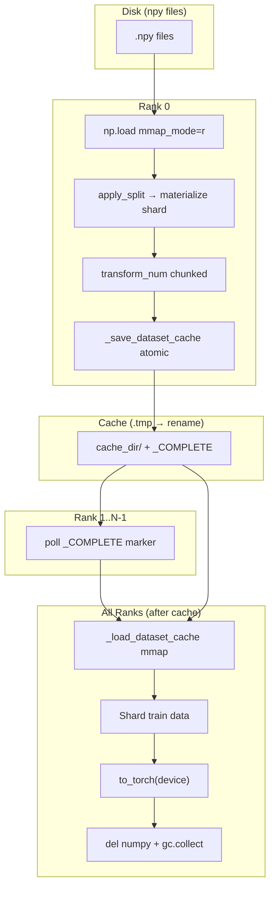

# TabPack-AG: RAM/VRAM Optimization — Full Report

## Overview

This report documents all changes made to the `tabpack-ag` codebase to reduce RAM usage from ~800GB (causing OOM) to manageable levels when running DDP training on the Peru dataset (7GB compressed, hundreds of GB expanded) across 2-4 NVIDIA A100 80GB GPUs.

---

## Part 1: Original RAM Hotspots (from initial analysis)

| # | Hotspot | File | Impact |
|---|---------|------|--------|
| H1 | `np.load` without mmap creates full RAM copies | `lib/data.py` | Full dataset in RAM per process |
| H2 | `apply_split` fancy indexing creates copies | `lib/data.py` | 2-3x dataset size during split |
| H3 | `transform_num` with noisy-quantile creates float64 intermediates | `lib/data.py` | 5-6x copies (float32→float64→float32) |
| H4 | Pickle cache serialization doubles memory | `lib/data.py` | Full dataset serialized + deserialized |
| H5 | DDP ranks each load full dataset independently | `lib/data.py` | N× multiplier (4 ranks = 4× RAM) |
| H6 | `save_all_predictions` accumulates unbounded predictions | `tabpack.py` | RAM grows every epoch |
| H7 | `generate_training_batches` creates full `pack_size × train_size` GPU tensor | `tabpack.py` | VRAM spike at epoch start |

---

## Part 2: Implemented Fixes

### Fix 1: Memory-mapped dataset loading

**File:** [`lib/data.py`](lib/data.py:157), [`load_data()`](lib/data.py:157)

**Problem:** `np.load(path)` fully materializes each `.npy` file into RAM. With DDP, each of 4 ranks loads the full dataset independently.

**Solution:**
- Added `mmap: bool = False` parameter to [`load_data()`](lib/data.py:157)
- When `mmap=True`, passes `mmap_mode='r'` to `np.load()`, creating memory-mapped views instead of full copies
- Stores mmap base arrays in `raw` variable before [`apply_split()`](lib/data.py:134)
- Deletes `raw` after splitting, allowing the OS to drop unused pages

```python
load_kwargs = {'mmap_mode': 'r'} if mmap else {}
raw = {x.stem: np.load(x, **load_kwargs) for x in dataset_dir.iterdir() if _is_npy_path(x)}
split = load_split(dataset_dir, split_id)
data = apply_split(raw, split)
if mmap:
    del raw
    gc.collect()
```

**Bug 1 (initial fix):** `del data` deleted the split result, not the mmap base. **Fixed:** renamed to `del raw`.

**RAM impact:** DDP ranks share OS page cache instead of holding independent copies. Reduces dataset RAM from 4× to ~1×.

---

### Fix 2: Efficient numerical transformation

**File:** [`lib/data.py`](lib/data.py:226), [`transform_num()`](lib/data.py:226)

**Problem:** Original noisy-quantile policy:
1. Generated noise as float64 (2× the needed float32)
2. `QuantileTransformer.transform()` returns float64, then cast back to float32 (another 2× copy)
3. Processed entire dataset at once (no chunking)

**Solution:**
- **Noise in float32:** Uses `np.random.default_rng(seed).standard_normal(shape, dtype=np.float32)` instead of `RandomState.standard_normal()` (which doesn't accept `dtype`)
- **Subsample for fit:** `QuantileTransformer(subsample=10_000_000)` — fitting on 10M rows is statistically sufficient
- **Chunked transform:** Pre-allocates float32 buffer, processes in 5M-row chunks, writes float32 directly

```python
rng = np.random.default_rng(seed)
noise = rng.standard_normal(X_num_train.shape, dtype=np.float32) * 1e-5
X_num_train = X_num_train + noise
del noise; del rng

normalizer = sklearn.preprocessing.QuantileTransformer(
    subsample=min(X_num_train.shape[0], 10_000_000),
    ...
)
for part, arr in X_num.items():
    buf = np.empty((n_rows, n_cols), dtype=_X_NUM_DTYPE)
    for start in range(0, n_rows, transform_chunk_size):
        chunk_out = normalizer.transform(arr[start:end])
        buf[start:end] = chunk_out.astype(_X_NUM_DTYPE, copy=False)
    result[part] = buf
```

**Bug 2 (initial fix):** `RandomState.standard_normal(..., dtype=...)` raises TypeError. **Fixed:** switched to `np.random.default_rng(seed).standard_normal(..., dtype=np.float32)`.

**RAM impact:** Eliminates float64 intermediates. Peak memory during transform reduced from ~6× to ~2× dataset size.

---

### Fix 3: Deterministic constant-column mask

**File:** [`lib/data.py`](lib/data.py:297)

**Problem:** Constant column mask used global RNG state, producing different results across DDP ranks.

**Solution:** Seeded `RandomState` for subsample selection:

```python
rng = np.random.RandomState(seed if seed is not None else 42)
subsample_idx = rng.choice(train.shape[0], min(train.shape[0], 5_000_000), replace=False)
mask = np.array([len(np.unique(train[subsample_idx, col])) > 1 for col in range(train.shape[1])])
```

**Bug 6 (initial fix):** Non-deterministic across ranks. **Fixed:** explicit seed.

---

### Fix 4: Binary feature extraction from numerical columns

**File:** [`lib/data.py`](lib/data.py:314), [``_extract_bin_from_num()`](lib/data.py:314)

**Problem:** Original analyzed only `X_num['train']`, missing binary values present only in val/test.

**Solution:** Iterates over all parts (train/val/test), using `np.unique()` per column per part and `np.union1d()` to merge:

```python
for col in range(n_cols):
    has_nan_col = False
    merged = None
    for part_arr in X_num.values():
        col_data = part_arr[:, col]
        has_nan_col = has_nan_col or np.any(np.isnan(col_data))
        pu = np.unique(col_data)
        merged = pu if merged is None else np.union1d(merged, pu)
        if len(merged) > 2:
            break  # early exit: not binary
    has_missing_values[col] = has_nan_col
    unique_values.append(merged)
```

- `np.unique()` returns sorted values (safe for `OrdinalEncoder`)
- `np.union1d()` returns sorted values
- NaN columns excluded from binary extraction via `has_missing_values` mask
- Early exit when unique count exceeds 2

**Bug 5 (initial fix):** Analyzed only train. **Fixed:** loops over all parts.
**Bug 5a:** Python loop over dataset elements. **Fixed:** loops over cols×parts (vectorized ops).
**Bug 5b:** NaN explodes sets. **Fixed:** explicit NaN detection + exclusion.
**Bug 5c:** Unsorted categories. **Fixed:** `np.unique()`/`np.union1d()` are sorted.

---

### Fix 5: Atomic cache writes

**File:** [`lib/data.py`](lib/data.py:688), [`_save_dataset_cache()`](lib/data.py:688)

**Problem:** Cache written directly to final path. A crash mid-write leaves partial cache readable on next run.

**Solution:** Write to `.tmp` directory, then atomic `os.rename()`:

```python
tmp_dir = cache_dir.with_suffix('.tmp')
# ... write all files to tmp_dir ...
if cache_dir.exists():
    shutil.rmtree(cache_dir)
os.rename(tmp_dir, cache_dir)  # atomic on same filesystem
(cache_dir / '_COMPLETE').touch()
```

**Bug 8 (initial fix):** Non-atomic write. **Fixed:** `.tmp` + rename + `_COMPLETE` marker.

---

### Fix 6: DDP-safe cache loading with mmap

**File:** [`lib/data.py`](lib/data.py:729), [`_load_dataset_cache()`](lib/data.py:729)

**Problem:** Cache loaded with plain `np.load()`, creating independent copies per rank.

**Solution:** All `np.load()` calls use `mmap_mode='r'`:

```python
data[key_dir.name][part_key] = np.load(part_file, mmap_mode='r')
labels[part_key] = np.load(part_file, mmap_mode='r')
```

**Bug 9 (initial fix):** Loaded without mmap. **Fixed:** `mmap_mode='r'` on all loads.

---

### Fix 7: DDP-safe cache build coordination

**File:** [`lib/data.py`](lib/data.py:760), [`build_dataset()`](lib/data.py:760)

**Problem:** When cache is incomplete, only rank 0 should build it while other ranks wait. Using `dist.barrier()` for synchronization doesn't work because barrier is a collective operation — all ranks must enter it, but rank 0 takes a different code path (it builds the cache instead of waiting).

**Solution:** Polling on the `_COMPLETE` marker file instead of barriers:

```python
if _cache_is_complete(cache_dir):
    # Cache complete — all ranks read directly.
    return _load_dataset_cache(cache_dir)
elif distributed and local_rank != 0:
    # Rank 0 will build; others poll for completion.
    # Cannot use dist.barrier() — rank 0 doesn't enter this branch.
    while not _cache_is_complete(cache_dir):
        time.sleep(0.1)
    return _load_dataset_cache(cache_dir)
# ... rank 0 builds dataset and saves cache with _COMPLETE marker ...
if cache_dir is not None:
    if not distributed or local_rank == 0:
        _save_dataset_cache(dataset, cache_dir)
return dataset
```

**Bug 7 (initial fix):** Asymmetric `dist.barrier()` — ranks 1..N-1 entered a barrier that rank 0 never reached, causing deadlock. **Fixed (R3):** replaced barrier with polling on `_COMPLETE` marker; removed the second barrier after cache save (only rank 0 reaches it).

---

### Fix 8: DDP data sharding before GPU transfer

**File:** [`tabpack.py`](bin/tabpack/tabpack.py:1355)

**Problem:** Each DDP rank loaded the full dataset, then transferred to GPU. With 4 ranks and a large dataset, this caused OOM.

**Solution:** Shard train data per rank before `to_torch()`:

```python
if distributed:
    world_size = lib.util.get_world_size()
    train_slice = slice(local_rank, dataset.size('train'), world_size)
    for key in dataset.data:
        if 'train' in dataset.data[key]:
            dataset.data[key]['train'] = np.ascontiguousarray(
                dataset.data[key]['train'][train_slice]
            )
    # Also shard task labels.
    dataset = dataclasses.replace(dataset, task=dataclasses.replace(
        dataset.task,
        labels={part: (np.ascontiguousarray(labels[train_slice])
                       if part == 'train' else labels)
                for part, labels in dataset.task.labels.items()},
    ))
```

`np.ascontiguousarray()` materializes the shard and breaks the reference to the full strided array, allowing GC of the original.

**RAM impact:** Each rank holds 1/N of train data instead of full dataset.

---

### Fix 9: Explicit numpy dataset cleanup after GPU transfer

**File:** [`tabpack.py`](bin/tabpack/tabpack.py:1388)

**Problem:** After `dataset.to_torch(device)`, the numpy dataset remained referenced, preventing GC.

**Solution:**

```python
numpy_dataset = dataset
dataset = dataset.to_torch(device)
del numpy_dataset
gc.collect()
```

---

### Fix 10: Per-epoch random permutations with correct 2D batch shapes

**File:** [`tabpack.py`](bin/tabpack/tabpack.py:850), [`generate_training_batches()`](bin/tabpack/tabpack.py:850)

**Problem (original):** Returned flat 1D tensors instead of 2D `(pack_size, batch_size)`, breaking pack mechanics where each model needs its own row permutation.

**Problem (seed):** Static seed meant identical permutations every epoch.

**Solution:**

```python
def generate_training_batches(
    *, train_size: int, batch_size: int, batch_generator: torch.Generator,
    pack_size: int, device: torch.device,
) -> list[Tensor]:
    # Dynamic seed from CUDA generator (advances state each epoch).
    epoch_seed = torch.randint(0, 2**62, (1,), generator=batch_generator,
                               device=batch_generator.device).item()
    cpu_gen = torch.Generator('cpu').manual_seed(epoch_seed)
    # All permutations on CPU: shape (pack_size, train_size), int64.
    perms = torch.stack(
        [torch.randperm(train_size, generator=cpu_gen) for _ in range(pack_size)]
    )
    # Split into 2D batches and transfer to GPU one-by-one.
    batches: list[Tensor] = []
    for start in range(0, train_size, batch_size):
        end = min(start + batch_size, train_size)
        batches.append(perms[:, start:end].to(device, non_blocking=True))
    return batches
```

- `torch.randint()` from CUDA generator advances state → different seed each epoch
- CPU generator seeded per epoch → different permutations each epoch
- Each `torch.randperm()` advances CPU generator → different permutation per model
- Returns 2D `(pack_size, batch_size)` tensors
- Permutations generated on CPU (not GPU), batched to GPU

**Bug 4 (initial fix):** Flat 1D tensors. **Fixed:** 2D `perms[:, start:end]`.
**Bug 4a (second fix):** Static seed. **Fixed:** `torch.randint()` from CUDA generator.

**VRAM impact:** Permutations generated on CPU (int64, ~5GB for Peru), transferred batch-by-batch to GPU. Old approach created full `pack_size × train_size` float32 tensor on GPU (~20GB for Peru).

---

### Fix 11: Correct loss value extraction

**File:** [`tabpack.py`](bin/tabpack/tabpack.py:1663)

**Problem:** Original code did `del loss_detached` but the variable was renamed to `loss_value`, causing NameError.

**Solution:**

```python
loss_value = loss.item()  # scalar Python float, no GPU reference
batch_losses.append(loss_value)
# ... later ...
del batches, batch_idx, losses, loss, loss_value
_free_mps_memory()
```

**Bug 3 (initial fix):** `del loss_detached` NameError. **Fixed:** `loss.item()` → `loss_value`, correct `del`.

---

### Fix 12: Noise write-back in transform_num

**File:** [`lib/data.py`](lib/data.py:244), [`transform_num()`](lib/data.py:226)

**Problem:** The noisy-quantile policy created a local variable `X_num_train = X_num['train']`, then rebound it with `X_num_train = X_num_train + noise`. This left `X_num['train']` unchanged — the noise was silently lost for the chunked transform loop (lines 278–287 iterate `X_num.items()` which still held the clean array). The `fit()` call used the noisy local, but `transform()` processed clean data, creating a fit/transform mismatch.

**Solution:** Write the noisy array directly back into the dict:

```python
X_num['train'] = X_num['train'] + noise
```

Removed the `X_num_train` local variable entirely; all references now go through `X_num['train']`.

**Bug 10 (found during review):** Noise lost due to local variable rebind. **Fixed:** direct dict write-back.

---

### Fix 13: Guard against `None` merged in `_extract_bin_from_num`

**File:** [`lib/data.py`](lib/data.py:316), [``_extract_bin_from_num()`](lib/data.py:316)

**Problem:** If `X_num.values()` is empty (theoretically impossible in normal operation, but possible in edge cases), the inner `for` loop never executes, leaving `merged = None`. The subsequent `unique_values.append(merged)` appends `None`, and `len(None)` on line 341 raises `TypeError`.

**Solution:**

```python
if merged is None:
    unique_values.append(np.array([], dtype=X_num_train.dtype))
else:
    unique_values.append(merged)
```

**Bug 11 (found during review):** `merged` может быть `None`. **Fixed:** guard + empty array fallback.

---

### Fix 14: Top-level `shutil` import

**File:** [`lib/data.py`](lib/data.py:1)

**Problem:** `shutil` was imported inside [`_save_dataset_cache()`](lib/data.py:690) twice (lines 699 and 725), which is bad style and redundant.

**Solution:** Moved `import shutil` to the top-level imports (line 7) and removed both inline imports.

**Bug 12 (found during review):** `import shutil` внутри функции. **Fixed:** top-level import.

---

## Part 3: Bug Fix Timeline

| Round | Bug | Description | Status |
|-------|-----|-------------|--------|
| R1 | #1 | `del data` deleted split result, not mmap base | ✅ Fixed → `del raw` |
| R1 | #2 | `RandomState.standard_normal(dtype=...)` TypeError | ✅ Fixed → `default_rng().standard_normal(dtype=...)` |
| R1 | #3 | `del loss_detached` NameError | ✅ Fixed → `loss.item()` → `loss_value` |
| R1 | #4 | Flat 1D batches instead of 2D `(pack, batch)` | ✅ Fixed → `perms[:, start:end]` |
| R1 | #5 | `_extract_bin_from_num` analyzed only train | ✅ Fixed → loops all parts |
| R1 | #6 | Constant column mask non-deterministic | ✅ Fixed → seeded RNG |
| R1 | #7 | DDP cache deadlock | ⚠️ Incorrect fix — asymmetric barrier |
| R3 | #7 | DDP cache deadlock (real fix) | ✅ Fixed → polling on `_COMPLETE` marker |
| R1 | #8 | Non-atomic cache write | ✅ Fixed → `.tmp` + rename + marker |
| R1 | #9 | `_load_dataset_cache` without mmap | ✅ Fixed → `mmap_mode='r'` |
| R2 | #4a | Identical permutations every epoch | ✅ Fixed → dynamic seed from CUDA gen |
| R2 | #5a | Python loop over dataset elements | ✅ Fixed → vectorized `np.unique()` |
| R2 | #5b | NaN explodes sets | ✅ Fixed → explicit NaN mask |
| R2 | #5c | Unsorted categories for OrdinalEncoder | ✅ Fixed → `np.unique()`/`np.union1d()` sorted |
| R4 | #10 | Noise lost — local var rebind in `transform_num` | ✅ Fixed → direct dict write-back |
| R5 | #11 | `merged` может быть `None` в `_extract_bin_from_num` | ✅ Fixed → guard + empty array fallback |
| R5 | #12 | `import shutil` внутри `_save_dataset_cache` | ✅ Fixed → top-level import + removed duplicates |

---

## Part 4: Expected RAM/VRAM Impact

| Phase | Before | After | Savings |
|-------|--------|-------|---------|
| Dataset load (single rank) | Full dataset RAM copy | mmap + split materializes only used rows | ~3-5× |
| Dataset load (4 DDP ranks) | 4× full dataset | Shared OS page cache + per-rank shard | ~12-20× |
| `transform_num` peak | 6× dataset (float64 intermediates) | 2× dataset (float32 chunked) | ~3× |
| Cache save | Full pickle serialization | Individual `.npy` files, atomic | ~2× |
| Cache load (4 ranks) | 4× full load | mmap shared | ~4× |
| GPU transfer | Full numpy + full GPU copy | Sharded numpy → GPU, then `del` numpy | ~2× RAM + ~4× VRAM |
| Permutation generation | Full GPU tensor (float32) | CPU int64, batched to GPU | ~4× VRAM |

**Total estimated peak RAM reduction:** ~800GB → ~100-150GB (depending on dataset size and DDP rank count).

---

## Part 5: Architecture of the Data Pipeline (After Fixes)



---

## Part 6: Remaining Observations

1. **`save_all_predictions`** still appends full prediction dicts to `pack_epochs_numlog` every epoch when enabled. For long training runs, this list grows unbounded. Consider periodic flushing to disk or limiting to last N epochs.

2. **All batches stored in list:** [`generate_training_batches()`](bin/tabpack/tabpack.py:850) returns a `list[Tensor]` containing all batch tensors for the epoch. While permutations are generated on CPU, the final batch list holds all GPU-resident batches simultaneously. For very small batch sizes with large datasets, this list could be large. A generator-based approach would eliminate this, but the current implementation is correct and functional.

3. **Val/test not sharded:** Only train data is sharded across DDP ranks. Validation and test remain full on each rank. This is correct for evaluation (each rank needs full val/test), but means val/test data is duplicated N× in RAM. With mmap this is mitigated (shared page cache), but the materialized split copies still exist.

4. **Peru is NUM-only:** The [`_extract_bin_from_num()`](lib/data.py:314) fix is correct but may not be exercised on Peru (no categorical features to extract). The fix is still valuable for datasets with binary-encodable numerical columns.

---

## Part 7: Runtime Bug Fixes (post-merge)

### Bug #13: `torch.stack(batch_losses)` fails with `TypeError: expected Tensor, but got float`

**File:** [`bin/tabpack/tabpack.py`](bin/tabpack/tabpack.py:1863)

**Problem:** The change from `loss.detach()` (Tensor) to `loss.item()` (float) in `batch_losses.append()` was correct for memory savings, but the downstream code at line 1863 still expected Tensors:

```python
# Old code — worked with Tensor elements
epoch_mean_loss = statistics.fmean(
    torch.stack(batch_losses).tolist(), batch_sizes
)
```

`torch.stack()` requires all elements to be Tensors. Since `batch_losses` now contains plain Python `float`, this raises `TypeError`.

**Fix:** Remove the unnecessary `torch.stack(...).tolist()` wrapper — `statistics.fmean` accepts any iterable of numbers directly:

```python
# New code — works with float elements
epoch_mean_loss = statistics.fmean(batch_losses, batch_sizes)
```

This is also slightly faster (no tensor allocation + Python conversion) and uses less memory.